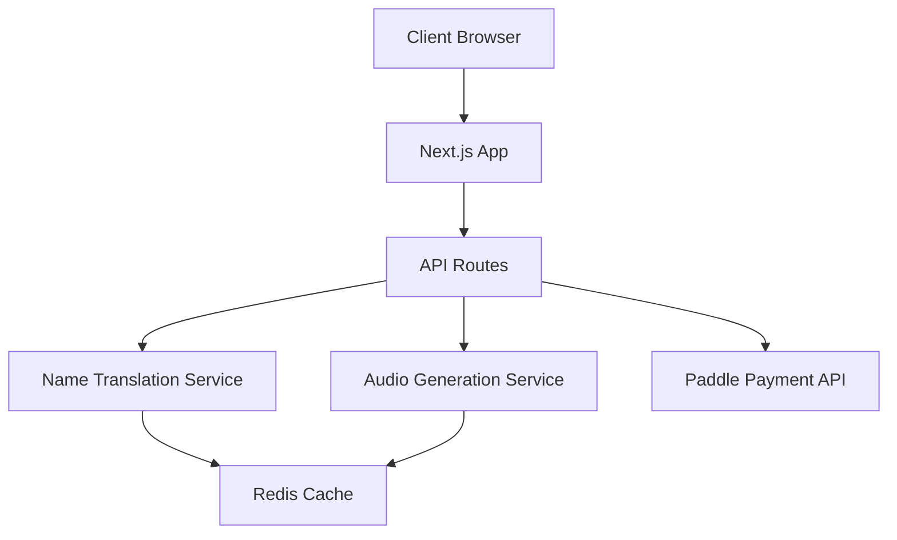

# System Patterns

## Architecture Overview

Korean Name Changer는 Next.js 13+ App Router를 기반으로 한 모던 웹 애플리케이션입니다.

## Key Components

### Frontend

- **Page Components**: Next.js 13+ App Router 기반 페이지 구성
- **UI Components**: Tailwind CSS와 shadcn/ui를 활용한 재사용 가능한 컴포넌트
- **State Management**: React Context와 상태 관리
- **Form Handling**: React Hook Form을 통한 폼 관리

### Backend (API Routes)

- **/api/generate-name**: 이름 변환 API
- **/api/generate-audio**: 발음 오디오 생성 API
- **/api/paddle**: Paddle 결제 웹훅 처리

### Services

- **Name Translation**: 한글 이름 영문 변환 로직
- **Audio Generation**: 발음 오디오 생성 서비스
- **Payment Processing**: Paddle을 통한 결제 처리
- **Caching**: Redis를 통한 결과 캐싱

## Design Patterns

### Component Patterns

- Atomic Design 원칙 적용
- Compound Components 패턴
- Render Props 패턴 (필요시)

### State Management

- React Context API 활용
- Custom Hooks 패턴
- Service Layer 패턴

### Error Handling

- Global Error Boundary
- API Error Handling
- Form Validation

### Performance Patterns

- Static Site Generation (SSG)
- Incremental Static Regeneration (ISR)
- Image Optimization
- Code Splitting

## Security Patterns

- API Rate Limiting
- CORS 설정
- Input Validation
- Payment Data 보안

## Testing Patterns

- Unit Testing: Jest
- Integration Testing: React Testing Library
- E2E Testing: Playwright
- API Testing: Supertest
